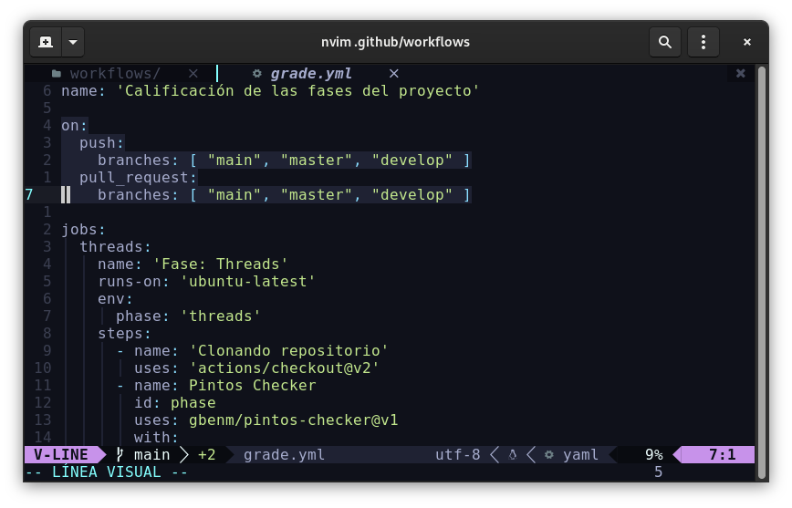
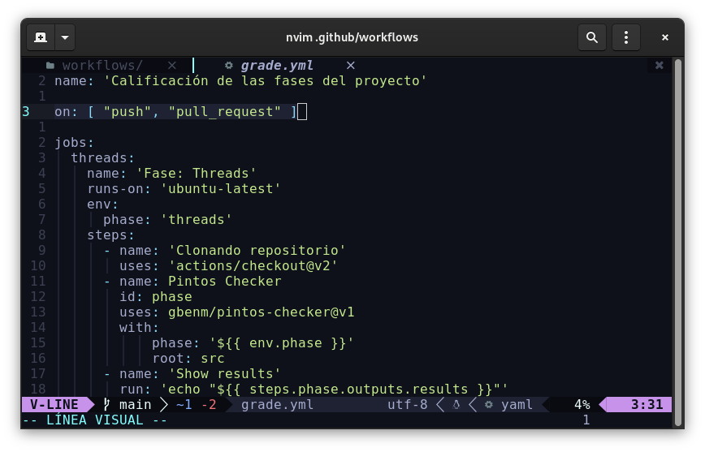
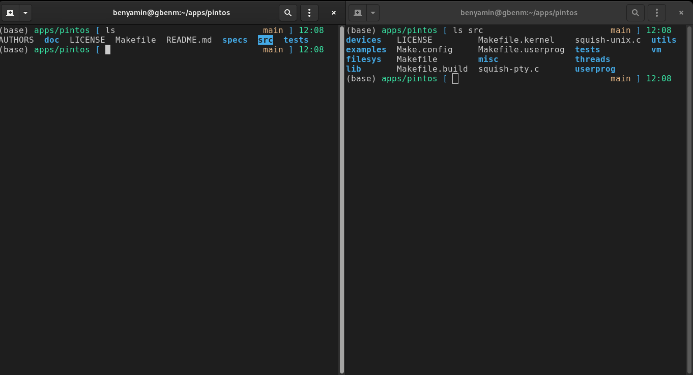

# Configuración

## Cambiar cuando se ejecutan los test

Hay una carpeta oculta sobre su repositorio, esta se llama **.github,** lo que debe modificar es el archivo .github/workflows/grade.yml



Y luego en los arreglos que ve en la imagen agregar sus ramas, claro también puede eliminar si hay ramas que no usa o bien no quiere que desencadenen las acciones.

Si opta por ejecutar sobre todos los commits y pull request coloque lo siguiente (recomendado si el repositorio es público):



## Configuraciones para casos extremos

### Configurar directorio de código



En el caso anterior toca realizar la configuración porque el repositorio tiene el código dentro de la carpeta **src**. Abra el archivo `.github/workflows/grade.yml` y modifique las 4 ocurrencias de **root**, por el directorio que contiene su código, en el caso del ejemplo anterior sería **src**:

```yaml {21}
name: 'Calificación de las fases del proyecto'
on:
  push:
    branches: [ "main", "master", "develop" ]
  pull_request:
    branches: [ "main", "master", "develop" ]
jobs:
  threads:
    name: 'Fase: Threads'
    runs-on: 'ubuntu-latest'
    env:
      phase: 'threads'
    steps:
      - name: 'Clonando repositorio'
        uses: 'actions/checkout@v2'
      - name: Pintos Checker
        id: phase
        uses: gbenm/pintos-checker@v1
        with:
            phase: "${{ env.phase }}"
            root: "src" # este de acá!! (antes tenía un .)
            utils_path: "utils"
            make: "make clean && make && make grade"
      - name: 'Show results'
        run: 'echo "${{ steps.phase.outputs.results }}"'
```

### Configurar comando make

Si en dado caso no funciona el evaluador por culpa de algún mensaje de make (cambiaron la implementación los de Stanford) o porque quiere poner un comando personalizado para correr los tests, modifque las 4 ocurrencias de **make** por su comando personalizado.

```yaml {23}
name: 'Calificación de las fases del proyecto'
on:
  push:
    branches: [ "main", "master", "develop" ]
  pull_request:
    branches: [ "main", "master", "develop" ]
jobs:
  threads:
    name: 'Fase: Threads'
    runs-on: 'ubuntu-latest'
    env:
      phase: 'threads'
    steps:
      - name: 'Clonando repositorio'
        uses: 'actions/checkout@v2'
      - name: Pintos Checker
        id: phase
        uses: gbenm/pintos-checker@v1
        with:
            phase: "${{ env.phase }}"
            root: "."
            utils_path: "utils"
            make: "mycustom .." # modifique esta línea
```

### Configurar carpeta de scripts

Si por alguna razón la carpeta de scripts ya no se llama **utils**, cambie las 4 ocurrencias de **utils\_path** por el directorio relativo a **root**.

```yaml {22}
name: 'Calificación de las fases del proyecto'
on:
  push:
    branches: [ "main", "master", "develop" ]
  pull_request:
    branches: [ "main", "master", "develop" ]
jobs:
  threads:
    name: 'Fase: Threads'
    runs-on: 'ubuntu-latest'
    env:
      phase: 'threads'
    steps:
      - name: 'Clonando repositorio'
        uses: 'actions/checkout@v2'
      - name: Pintos Checker
        id: phase
        uses: gbenm/pintos-checker@v1
        with:
            phase: "${{ env.phase }}"
            root: "."
            utils_path: "utils" # cambie la ruta
            make: "make clean && make && make grade"
```
