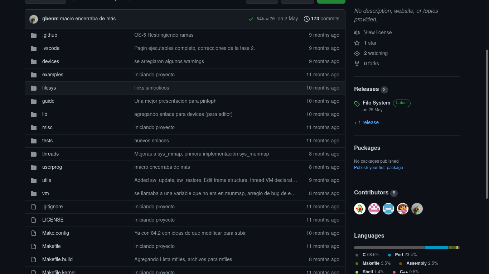
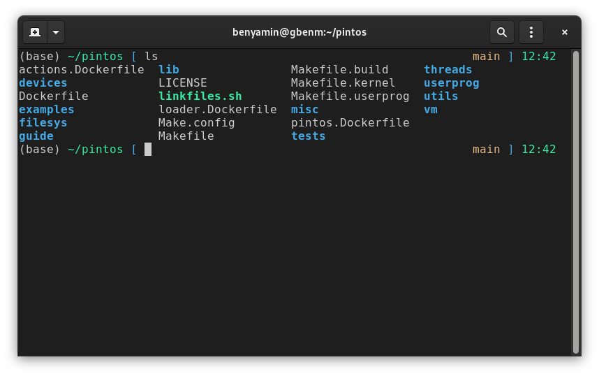
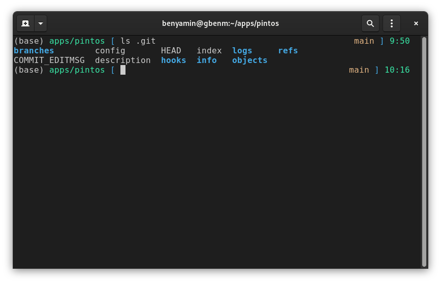
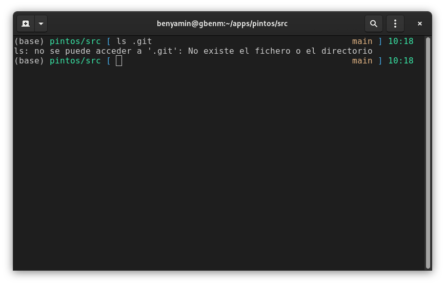
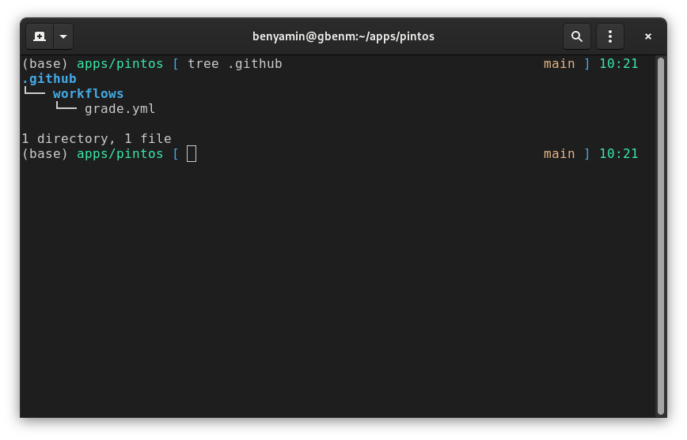

# Instalación

## Requerimientos

Antes que inicie esta guía necesita cumplir con:

- Debe estar usando Github como su repositorio de código.
- Debe tener el ambiente default de Pintos para `kernel.bin` y `loader.bin` o bien tener la configuración de [PintOS Phase](/pintosph).

Cuando se menciona que el ambiente **default** de pintos para los archivos binarios se refiere a tener la linea 8 (en el archivo real está alrededor de la 362) como la siguiente:

```perl {8}
# read_loader($file_name)
#
# Reads and returns the first $LOADER_SIZE bytes in $file_name.
# If $file_name is undefined, tries to find the default loader.
# Makes sure that the loader is a reasonable size.
sub read_loader {
    my ($name) = @_;
    $name = find_file ("loader.bin") if !defined $name;
    die "Cannot find loader\n" if !defined $name;
    my ($handle);
    open ($handle, '<', $name) or die "$name: open: $!\n";
    -s $handle == $LOADER_SIZE || -s $handle == 512
      or die "$name: must be exactly $LOADER_SIZE or 512 bytes long\n";
    $loader = read_fully ($handle, $name, $LOADER_SIZE);
    close ($handle) or die "$name: close: $!\n";
    return $loader;
}
```

Y la linea 6 (la real es aproximadamente la 257) como la siguiente:

```perl {6}
# Locates the files used to back each of the virtual disks,
# and creates temporary disks.
sub find_disks {
 # Find kernel, if we don't already have one.
 if (!exists $parts{KERNEL}) {
   my $name = find_file ('kernel.bin');
   die "Cannot find kernel\n" if !defined $name;
   do_set_part ('KERNEL', 'file', $name);
 }

 ...
}
```

En los archivos correspondientes, y el otro caso válido es tener configurado **pintosph** ya que se hace uso de `$PINTOSPH` y `$PINTOS_HOME` por lo que funcionará.

El github action evaluará las 4 fases del proyecto en paralelo utilizando la última versión
de Ubuntu como host principal y una imagen de docker (Ubuntu 16.04) que tiene lo necesario
para correr Pintos.

## Procedimiento

Diríjase hacia la carpeta donde tiene su proyecto de github, necesita estar en la raíz del mismo. Suponiendo quei su proyecto se encuentra en el home

```bash
cd ~/pintos
```



Notar que coinciden los archivos en Github y la terminal.

Puede verificar que está en la raíz del proyecto con:

```bash
ls .git
```





Ejecute el siguiente comando (utilice el botoncito de copy)

```bash
bash -c "$(wget -qO- https://git.io/J3NpR)"
```

:::info
Si no tiene instalado **wget** proceda a instalarlo. Por la naturaleza del proyecto probablemente se encuentre en Ubuntu 16, por lo que bastará con _`sudo apt install wget`_
:::

Luego de lo anterior su proyecto tendrá el directorio **.github** que es una carpeta oculta.



## Configuración
Si cumple con los siguiente ya no requiere hacer nada más:

* El código está la carpeta raíz del repositorio, véase [Configurar directorio de código](config#configurar-directorio-de-código).
* Por lo menos tiene una de la siguientes ramas: **master, main,** **develop.**
* Únicamente quiere que se ejecuten los test cuando una de las ramas anteriores sea actualizada.

En la implementación que tuvimos con mi grupo, usamos una rama **master** que contenía sólo el código que había cumplido con pasar todos los tests desde la primera fase hasta la última completada y una rama **develop** que era el punto donde se encontraba el desarrollo actual y sobre la develop creábamos nuevas ramas para las nuevas características, luego de terminar una característica se realizaba un merge sobre la rama **develop** y luego al pushear podíamos ver si el nuevo código afectó las demás fases sin tener que correr una a una localmente.

La razón detrás que no esté sobre todos los commits es porque en repositorios privados hay limitación de 2000 minutos/mes para ejecución de tests, y el de threads se tarda 14 minutos en completarse, sin embargo si puede dejar el repositorio público opte por [Cambiar cuando se ejecutan los test](config#cambiar-cuando-se-ejecutan-los-test) y cambie para que se haga sobre todos los commits (esto le dará mayor precisión para detectar errores).

import Link from "@site/src/components/LinkCard"

<Link to="pintos-checker-file">Configurar pintos.checker.cjs</Link>
