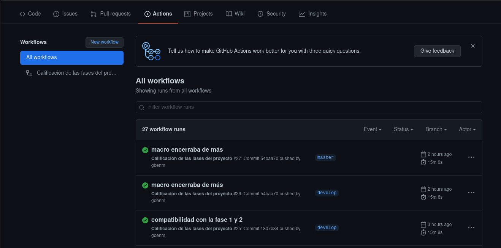
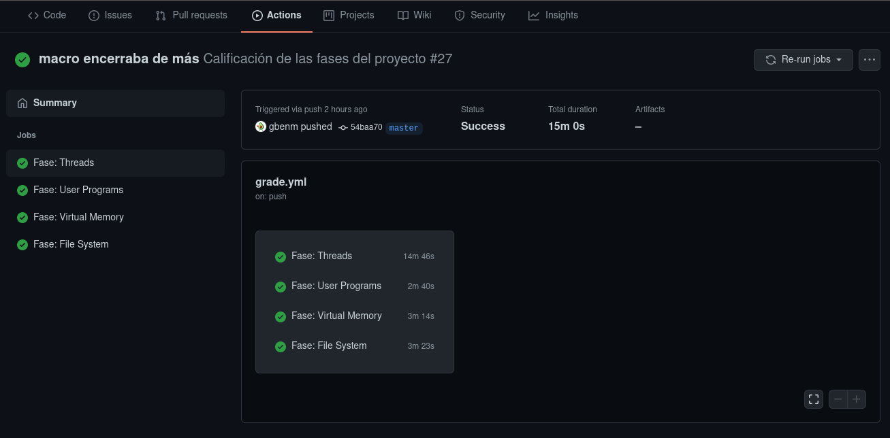
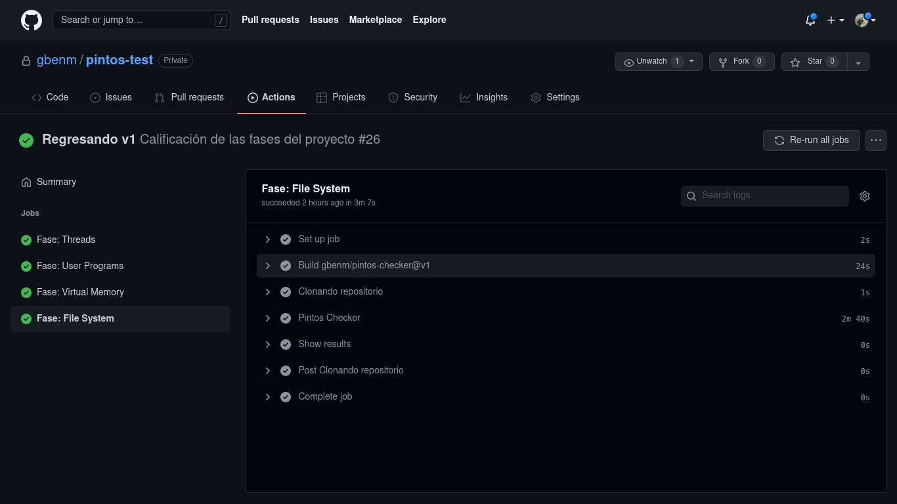
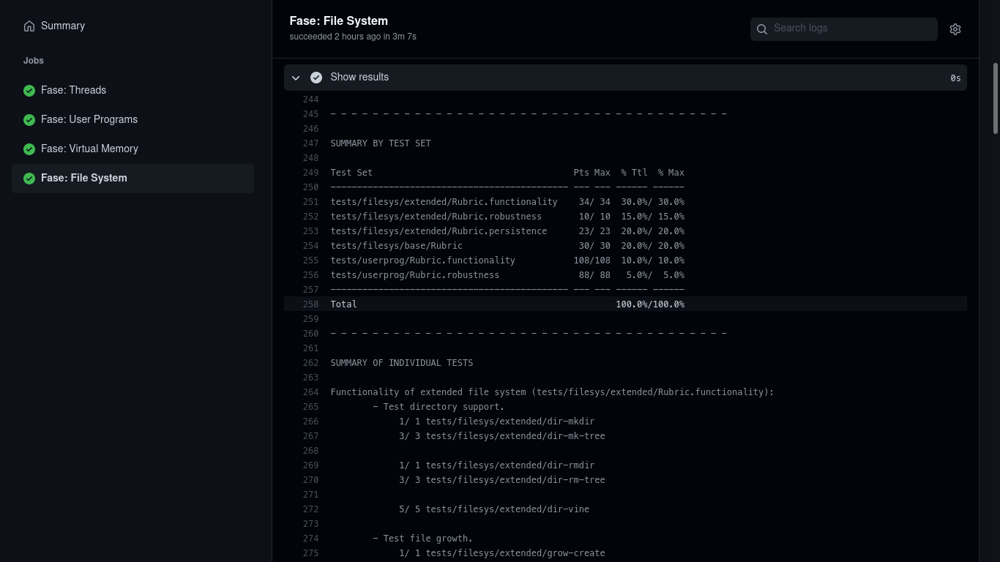

# Ver los resultados

Para ver los resultados (recuerde configurar si es necesario) es muy sencillo, diríjase a su repositorio y presione en **actions**:

Presione sobre el commit que desencadenó la acción:

Toque sobre la fase que quiere revisar

:::caution
Estos siempre deben aparecer en verde sino lo hacen es porque ocurrió un error inesperado o
porque falló la condición impuesta por usted.
:::

Tendrá disponible lo siguiente:

* **Set up Job** prepara el trabajo y es una acción por defecto.
* **Build gbenm/pintos-checker@v1** crea una imagen del action, también es una acción por defecto.
* **Clonando repositorio** toma su repositorio y lo clona en la máquina.
* **Pintos Checker** compila y ejecuta los tests de la fase, si este trabajo falla expándalo y verifique que fue lo que falló. También permite la visualización de los test que se corrieron (el output que sale cuando lo hace localmente).
* **Show results** si no hubieron problemas expándalo y observe su nota :)

:::info
**Show results** siempre debe de tener contenido, si no fue así algo ocurrió y es probable que su implementación haya fallado.
:::
