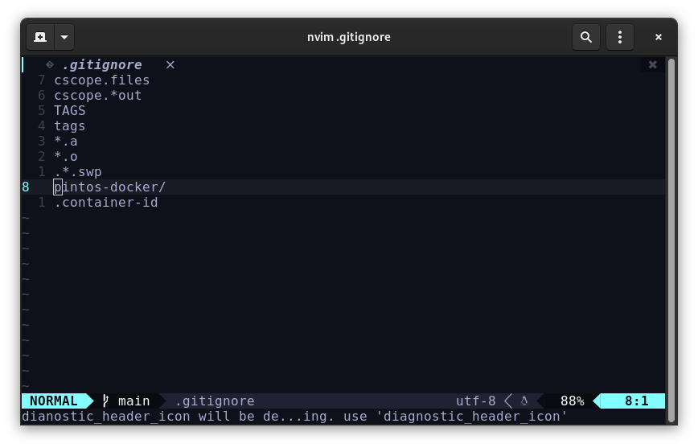

# Antes de usar (primera vez)

Estando **dentro del contenedor (ejecutó el script),** la primera vez ejecute:

```bash
source bash-config
```

Ahora tiene sincronizada la carpeta **pintos-docker** en su directorio pintos. Existe una carpeta llamada **host** (**\~/host)** dentro de su contenedor, puede utilizarla como punto de conexión además de la misma carpeta (código fuente).

El directorio **pintos-docker** también contiene el archivo **.bashrc** por lo que úselo para configurar si necesita, tenga en cuenta que le agregamos [ohmybash](https://github.com/ohmybash/oh-my-bash) para que se vea mejor, pero en el contenedor puede tener problemas a la hora de escribir comandos muy largos, el
tema recomendado es `brainy`

, pero si sucede esto, puede poner en blanco el string donde va el tema y ya no tendrá estos inconvenientes. Al inicio tiene un tema, el cuál está en `OSH_THEME`

```bash {5} title="~/.bashrc (original)" showLineNumbers
# Path to your oh-my-bash installation.
export OSH=/root/.oh-my-bash
# Set name of the theme to load. Optionally, if you set this to "random"
# it'll load a random theme each time that oh-my-bash is loaded.
OSH_THEME="font"
```

Debería queda similar a lo siguiente

```bash {5} title="~/.bashrc (después)" showLineNumbers
# Path to your oh-my-bash installation.
export OSH=/root/.oh-my-bash
# Set name of the theme to load. Optionally, if you set this to "random"
# it'll load a random theme each time that oh-my-bash is loaded.
OSH_THEME="brainy"
```

Si aún sigue teniendo problemas deje en blaco el valor en blaco

```bash {5} title="~/.bashrc" showLineNumbers
# Path to your oh-my-bash installation.
export OSH=/root/.oh-my-bash
# Set name of the theme to load. Optionally, if you set this to "random"
# it'll load a random theme each time that oh-my-bash is loaded.
OSH_THEME=""
```

También puede utilizar este contenedor para correr sus laboratorios sólo coloque alguna copia en **pintos-docker** y en su contenedor navegue a **\~/host** y testee, el contenedor ya tiene instalado lo necesario para compilar C, y puede instalar cosas ya que el script crea un sólo contendor y utlizar su identificador para ejecutarlo otra vez.

:::info
Puede ejecutar varias veces el script, la primera vez levanta el contenedor, las próximas veces abre una terminal dentro del contenedor. Al morir la terminal principal todos las demás mueren.
:::

:::caution
Espere a que se inicie el contenedor antes de volver a ejecutar el script.
:::

## Github

Agregue `.container-id` y a `pintos-docker` a su **.gitignore** ya que estos serán diferentes para cada usuario y no deberían porque estar en el repositorio.


