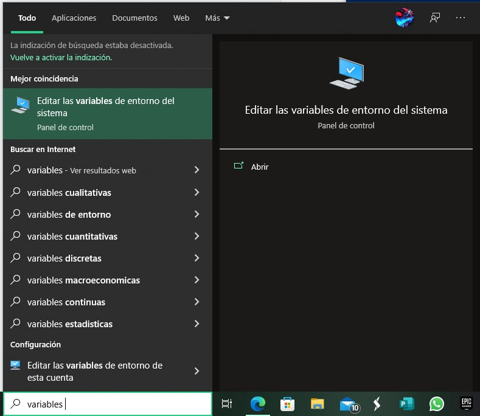
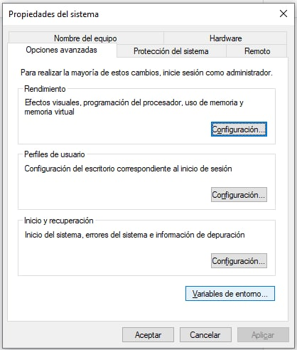
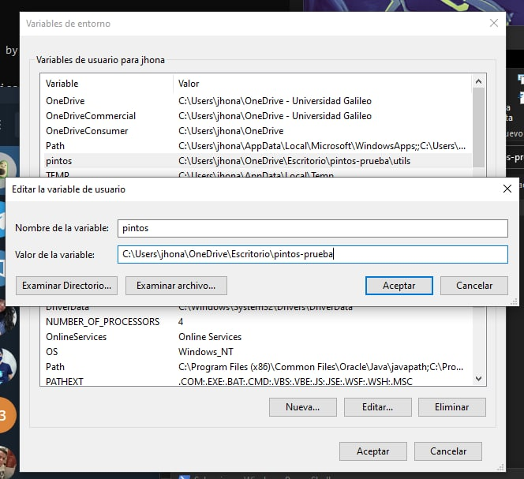

# Instalación

## Docker

Instale Docker desktop, tenga en cuenta que debe poder correr contenedores de Linux, por lo que va necesitar WSL, vaya al siguiente enlace y siga los pasos [Docker desktop](https://docs.docker.com/desktop/install/windows-install/)

## Descargar pintos-docker.bat

Aquí tiene libertad para escoger dónde lo va a descargar, mi propuesta es que lo haga junto con los demás scripts de pintos es decir en la carpeta **utils** dentro de su directorio de código pintos, de esta manera **sólo un integrante lo hace**, posteriormente crear un acceso directo a su escritorio y ya puede darle doble clic :). Ejecute los siguiente en un **PowerShell** dentro de el directorio de su elección (recuerde en Windows también puede usar **cd** para navegar entre directorios, una solución fácil podría ser copiar la ruta desde el explorador de archivos y lugo darle cd y copiar la ruta).

```batch
Invoke-WebRequest -Uri "https://bit.ly/3GWwPY9" -OutFile pintos-docker.bat
```
## Definir variable pintos

Para que el script descargado anteriormente funcione, se necesita crear una variable  entorno con el directorio absoluto al código de su proyecto.

Abra el menú de windows y busque por **variables de entorno.**



Presione el botón que dice variables de entorno.



Agregue una nueva variable de usuario, esta debe llamarse **pintos**, ya que el .bat utiliza este nombre (el valor es el path hacía el código de su proyecto).



## Crear un acceso directo (opcional)

Este paso sólo tiene sentido si dejaron el .bat dentro del repositorio, igual este no necesita estar junto con los otros scripts, sin embargo si lo colocó ahí podría dejar un acceso directo en su escritorio para simplemente ejecutarlo con un doble clic.
