# Crear un nuevo proyecto de PintOS

:::caution
Este paso es importante realizarlo desde vscode para los usuarios
de Windows ya que se debe tener cuidado al clonar, por defecto en este
sistema el separador de línea es CRLF mientras que en Linux (de esta forma se necesita para
que funcione correctamente el proyecto) es únicamente LF
:::


## Abre Visual Studio code
Para que funcione se debe de abrir una carpeta dónde se creará
el proyecto pintos, por ejemplo puedes abrir tu directorio
de documentos.

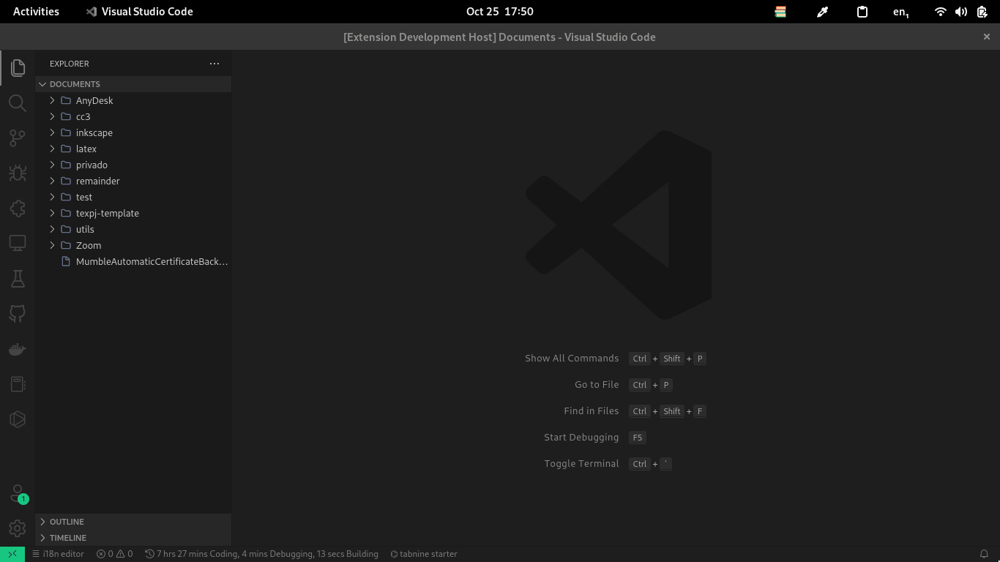

## Ejecuta el comando para crear nuevo proyecto
Abre los comandos de vscode (ctrl+shift+p) y escribe
**"pintos"** para encontrar el comando.

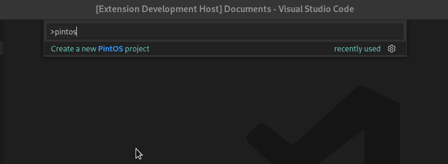

### Elige el repositorio base
> El valor por defecto puede cambiarse desde las configuraciones de vscode

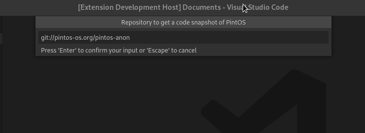

El valor por defecto es el repositorio original de pintos, otra opción
podría ser:

```
https://github.com/gbenm/pintos-tuto
```

qué es el repositorio que usé para explicar en los vídeos y que ya
tiene [PintOS Github Checker](/github-action) configurado. Lo que debe
tomar en cuenta son los últimos cambios en el proyecto, el repo anterior
tiene una copia del código de 2022 del cuál el último commit fue en **2021-05-29**.
Para verificar el contenido del repositorio copie y pegue el link por defecto
en el buscador y navegue a la pestaña de "tree", ahí encontrará el contenido.

### Elige la carpeta del código fuente
El repositorio podría no tener el código fuente directamente, este
es el caso del repositorio original de Pintos que contiene en la raíz
otros archivos y una carpeta `src/` con el código

<p align="center">

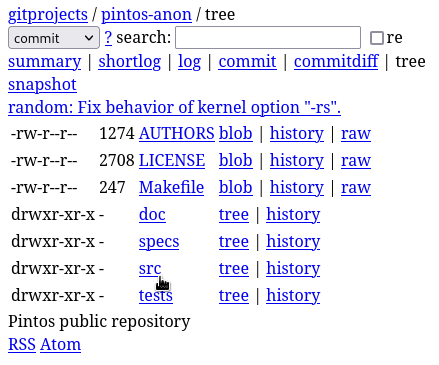

El repo se ve bien viejo, pero ni modo xD
</p>

En el caso que por ejemplo hayas usado https://github.com/gbenm/pintos-tuto
como proyecto base, este contiene el código fuente en la raíz

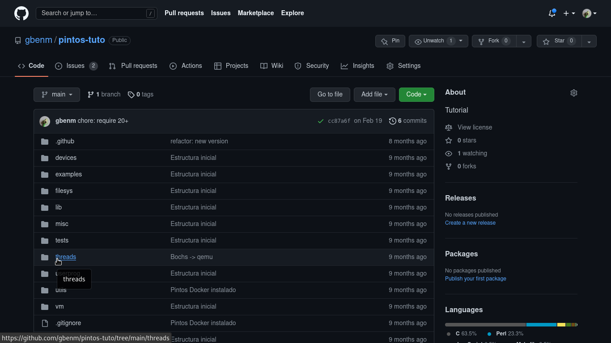

:::info
El directorio del código fuente contiene las carpetas `threads/`, `userprog/`, `vm/`, `filesys/`,
`utils/`, etc.
:::

Con esto en mente, el input actual luce como el siguiente y se debe llenar con
el nombre del folder que contiene el código:

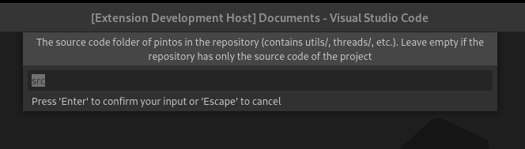

:::caution Importante
Si el código fuente está en la raíz del repositorio este valor
debe estar vacío
:::

### Nombre del proyecto
De un nombre a la carpeta que va contener su código fuente. Por ejemplo
`pintos`

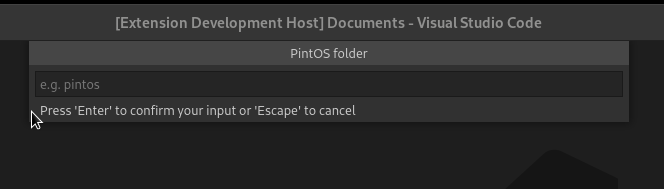


### Agregar el repositorio personal
Cómo último paso se le pregunta por el enlace a su repositorio personal,
esto es porque desde el inicio se deja configurado un repositorio.

1. Vaya a por ejemplo Github y cree un repo nuevo **debe estar vacío** por
su propia salud mental. La extensión no hace ni pull ni push, sólo un commit
inicial con lo que se ha descargado
2. Copie el URL puede ser de cualquier formato ya que sólo es para configurar
el git y para su uso personal (si quiere hasta puede poner cualquier texto aleatorio)
3. Pegue el link en el input y continue

  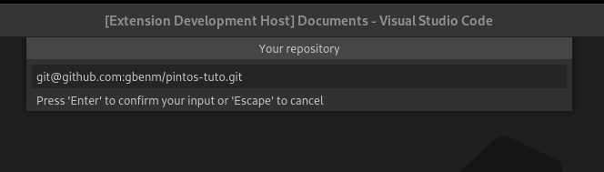
4. Puede abrir directamente el proyecto desde la notificación que emergió después del
último paso

  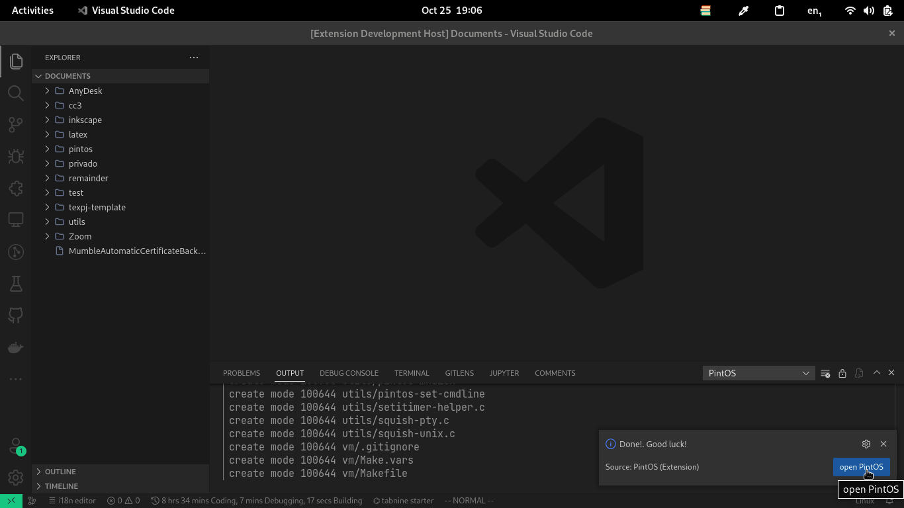

## Cambie el emulador
Este paso depende de lo que tenga instalado, por ejemplo si va utilizar el **dev container**
que provee esta extensión o va utilizar [PintOS ballenizado](/pintos-docker) que se basan
en la imagen de docker [gbenm/pintos](https://hub.docker.com/r/gbenm/pintos) **debe cambiar
el emulador** a `qemu`

1. Diríjase a threads/Make.vars y ábralo
  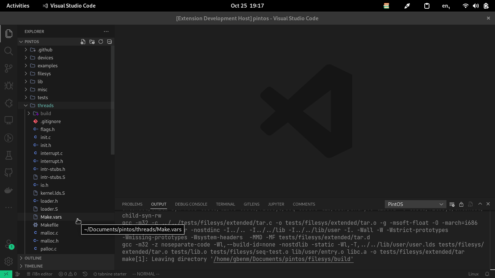
2. cambie el valor a `--qemu`
  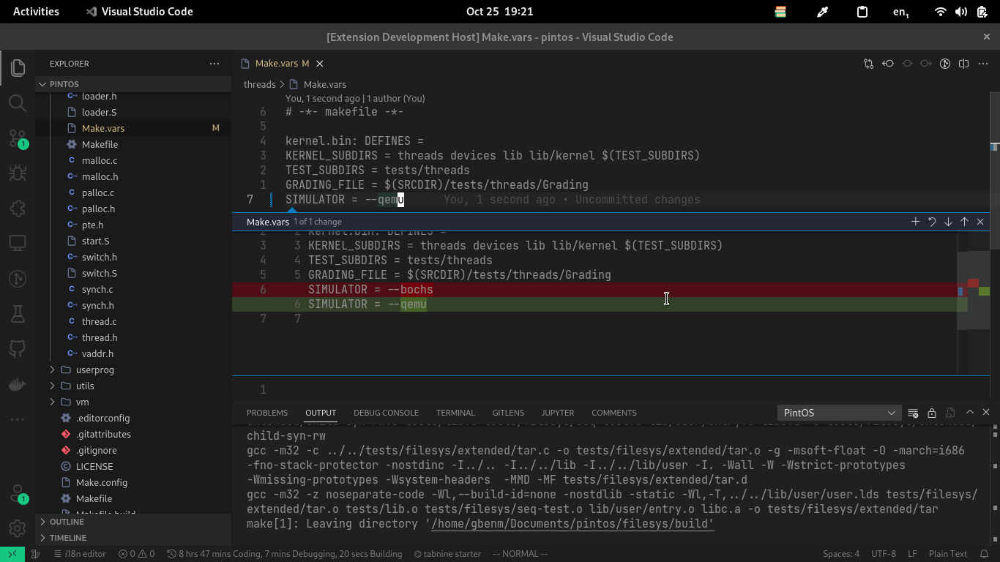
3. confirme sus cambios y haga su commit
  ```bash
  git add .
  git commit -m "chore: use qemu simulator"
  ```
