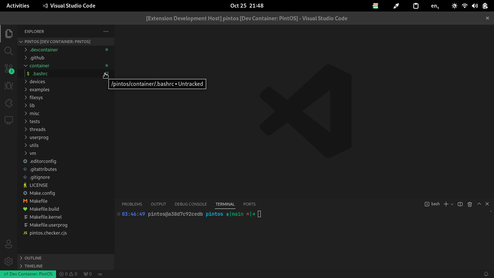

# Instalación
## Ejecutar el comando
> No necesitas cumplir los prerequisitos para generar los archivos

Busca el comando "setup dev container for pintos"

  

## Entra al contenedor
Entra por primera vez para que el contenedor se construya
> - Para esto si necesitas cumplir con los prerequisitos.
> - Asegúrate de que el servicio de Docker esté corriendo

- Ve a la parte inferior izquierda y presiona en el símbolo que se parece a `> <`

  

- Escoge "reopen in container"

  

> A veces aparece una notificación que te pregunta si quieres abrir el espacio de trabajo
en el contenedor, la cuál es otra forma de entrar

:::caution
Si por casualidad haz creado otro proyecto pintos anteriormente y le
haz configurado dev container, asegúrate de:
- Darle un nombre diferente a la carpeta de esta versión del proyecto
- Si le colocas el mismo nombre, debes eliminar el contenedor anterior

Esto es porque el contenedor no se elimina y va a tratar de utilzar
el anterior lo cuál va resultar en un error
:::

:::info
Si llegase a fallar intenta con "reintentar" o cerrar y volver abrir
el editor
:::

Todo ha ido bien si puedes ver esto en vez de símbolo anterior


## Configurar el contenedor
1. abre una terminal

  

  verás una terminal sin color como la siguiente

  

  > A partir de acá debes usar esta terminal para ejecutar lo que sigue

2. Coloca una contraseña para poder utilizar `sudo`. Ejecuta lo siguiente en la terminal abierta
  (mostrará un input para colocar la contraseña)
  ```bash
  passwd
  ```

3. Verifica que /host es de tu propiedad
  ```bash
  ls -l / | grep "host"
  ```

  Deberá aparecer "pintos pintos" en lo desplegado, si es así sigue con el paso 4
    - si aparece "root root" debes cambiar la propiedad de la carpeta es decir
      ```bash
      sudo chown pintos.pintos /host
      ```


4. Configura oh my bash
  ```bash
  source bash-config
  ```

  Deberá salirte una terminal con colores a partir de ahora

  

5. Verifica la propiedad del archivo ~/.bashrc
  ```bash
  ls -l container/.bashrc
  ```

  Deberá salir "pintos pintos"

    

    - si aparece "root root" debes cambiar la propiedad del archivo
      ```bash
      sudo chown pintos.pintos container/.bashrc
      ```

6. (Opcional) el tema actual de **oh my bash** para Ubuntu 16.04 no funciona bien (si escribes
  y llegas al límite se empieza a sobreescribir lo que haz escrito antes), te recomiendo cambiarlo
  a `brainy`

  - Abre `container/.bashrc`

    

  - Cambia `OSH_THEME="font"` por `OSH_THEME="brainy"`

    

  - En la terminal que haz usado ejecuta lo siguiente para refrescar el tema

    ```bash
    source ~/.bashrc
    ```

> Puedes encontrar más temas en [oh my bash](https://github.com/ohmybash/oh-my-bash/wiki/Themes)

7. Haz un commit con tus cambios
  ```bash
  git add .
  git commit -m "chore: setup dev container"
  ```

## Verifica que la extensión esté instalada
Y mi extensión? Verás las extensiones como esta (de tipo workspace) se ejecutan del
lado del contenedor, ve al apartado de las extensiones y busca pintos y verifica que
se encuentre instalada


## Limpia y compila los tests
Si estabas en un sistema con gcc, make, etc. Es probable que se hayan compilado las
fases del proyecto, por lo que los archivos resultantes no sirven, ve a la sección de
testing en la barra lateral y dale al icono de refrescar


y luego selecciona las 4 fases


# Verifica que el proyecto esté bien instalado
Sigue los pasos listados [aquí](./check-health)
