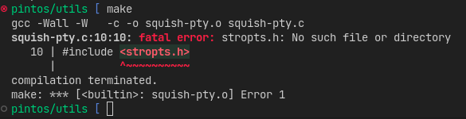

# Introducción

## Qué es?
Esta una característica de vscode que te permite desarrollar dentro
de un contenedor de Docker utilizando únicamente el editor para enlazarte,
al contrario de [PintOS Ballenizado](/pintos-docker) no necesita montar
los volúmenes ni abrir nuevas terminales para poder utilizar el contenedor
(es decir está más fácil xD), puedes consultar más información en la
documentación oficial de [dev containers](https://code.visualstudio.com/docs/remote/containers).

## Por qué debería usarlo?
### Respuesta - Común
- No tienes que instalar lo que necesita PintOS para ejecutarse
- Cuándo usas máquinas virtuales
  - Necesitas más recursos
  - Fácilmente se traban (en el peor de los casos podrías perder tu código si no haces commits con frecuencia)
- Puedes usar cualquier cosa que ya conoces

### Respuesta - Windows
El proyecto fue desarrollado para usarlo en linux xD.

> Aquí se podría tratar de correr con `WSL` puro, si alguien intenta y le funciona por favor ayuda a extender la guía :D

### Respuesta - Unix like
> Contaré macOS ya que creo que podría ser posible ejecutarse nativamente

- Los GNU/Linux actuales no incluyen `stropts.h` puedes ver una respuesta
relacionado a esto [aquí](https://stackoverflow.com/questions/61010487/stropts-h-on-ubuntu-19-10).
Al compilar utils te saltará un error.

  

  Esto sólo importa si vas utilizar bochs o vmware (según la doc) ya que al menos en qemu no es necesario
  los binarios resultantes del `make`
- Al ejecutar `make` con un sistema moderno el tamaño del `loader.bin` es de `129M` cuándo
debería ser de `512B` (una diferencia increíble)

Si logras pasar esos dos obstáculos no es necesario que utilices Docker para correr
tu implementación.

## Prerequisitos para utilización
- Tener una instalación de docker capaz de ejecutar contenedores de linux (Esto es un punto
a tomar en cuenta en Windows, busca una guía para instalar Docker para esto), puedes consultar
la documentación oficial de docker si lo encuentras más fácil https://docs.docker.com/desktop/
- Un Visual Studio Code que soporte esta característica
