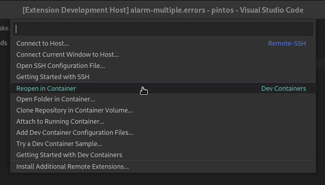

# Uso
> - Asegúrate de que el servicio de Docker esté corriendo

- Abre visual studio code en la carpeta del proyecto
- Ve a la parte inferior izquierda y presiona en el símbolo que se parece a `> <`

  

- Escoge "reopen in container"

  

> si te aparece una notificación que te pregunta si quieres abrir el espacio de trabajo
en el contenedor puedes usar esa forma también.
