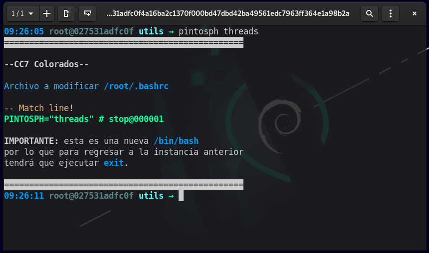
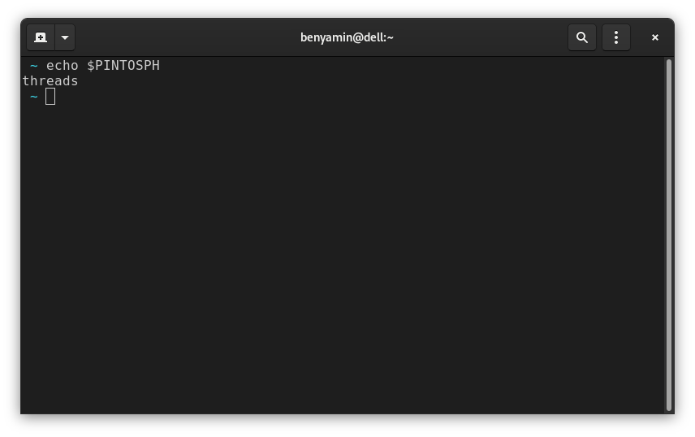

# Cambiar de fase

## Procedimiento

Fue un poco tedioso, pero ahora sólo necesita ejecutar una instrucción para cambiar de fase yeeh! :smile:, lo anterior un sólo integrante del grupo debe hacerlo, subirlo a su repositorio y manos a la obra, no tendrá que agregarlo al `.gitignore` ni nada por el estilo para evitar los conflictos entre los cambios.

Para cambiar de fase entonces ejecute:

```bash
pintosph <carpeta>
```

donde **&#x3C;carpeta&#x3E;** debería ser el nombre del folder donde se encuentra trabajando, es decir que para que no le diga un _"Cannot find kernel"_ o _"Cannot find Loader"_ debería tomar un nombre entre: **threads, userprog, vm, filesys.**

:::caution
**pintosph** es un script hecho con **perl**, de este modo no tiene que instalar nada que pintos no necesite, además por las limitaciones no se pueden alterar las variables de entorno por lo que pintosph abre una nueva instancia, por lo que para regresar a la anterior deberá ejecutar **exit**.
:::

## Ejemplo

Para comenzar su travesía ejecute:

```bash
pintosph threads
```

Después de ejecutarlo verá lo siguiente en su terminal, cabe decir que **no importa el lugar donde lo ejecute.**



Para saber en que fase está en la terminal actual ejecute:

```bash
echo $PINTOSPH
```


