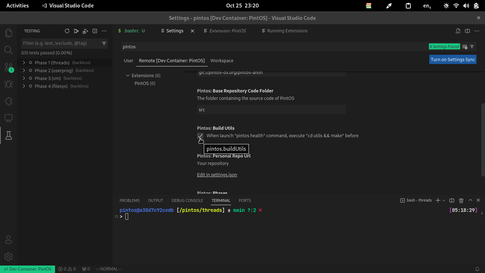
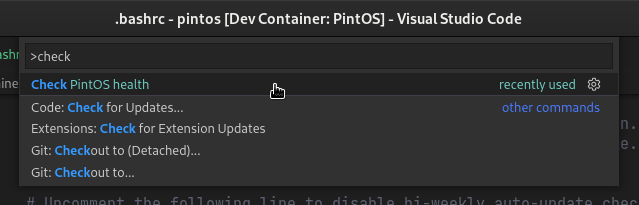
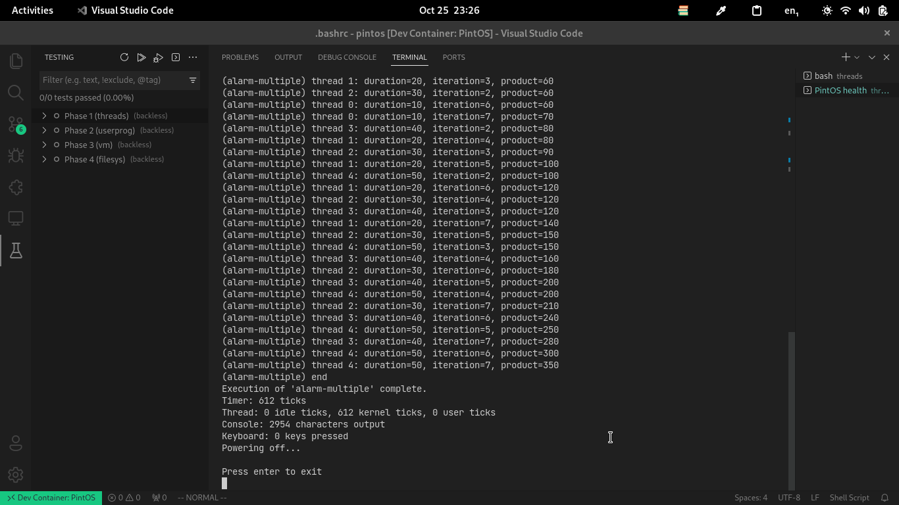

# Verificar la salud del proyecto

:::note
Por defecto se compilan las utilidades antes de ejecutar el health,
si quieres probar suerte en tu OS probablemente no puedas compilar
utils, puedes saltarte este paso desmarcando la opción en las configuraciones,
pero sería buena idea si pruebas primero sin tocar el valor

:::

## Ejecuta el comando
De nuevo abre los comandos (ctrl+shift+p) y busca por "check pintos health"

## Verifica el output del comando
Expande la terminal y mira los resultados, si no ves ningún error presiona
"enter" para finalizar

