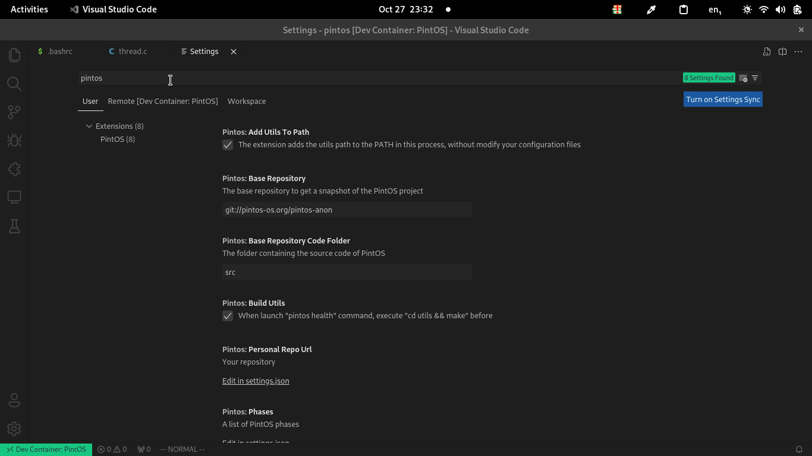

# Configuraciones de la extensión

Pueden ser encontradas al buscar en las configuraciones del editor **"pintos"**

## Add Utils to PATH

Make hace uso de la CLI de `pintos` por lo que la shell actual debe poder reconocer
dónde se encuentra el script, la extensión es capaz de agregar la localización
del script sin cambiar ningún archivo de configuración, únicamente utilizando
el proceso actual de la extensión (no afecta al exterior)

:::note
Además de `pintos` existen otros scripts dentro de la carpeta `utils/`, pero
al dejar esta opción activa la extensión no tiene problemas para utilizar cualquiera
de ellos
:::

## Base repository

Este es el URL que se muestra como opción por predeterminada cuándo se
require descargar una copia del código del proyecto, se puede cambiar
a cualquier otra fuente soportada por `git`, tener en cuenta que no
se piden credenciales por lo que es necesario que se pueda descargar
el repositorio sin necesidad de las mismas (repositorios públicos o utilizando
SSH)

## Base Repository Code Folder

Cuándo el repositorio fuente no tiene el código fuente directamente sino que
en una de sus carpetas, es necesario indicar de que carpeta se copiará el código,
este valor se usa como predeterminado al clonar, sin embargo se puede cambiar
en el proceso.

:::info
Si la consola `git` soporta `sparse-checkout` sólo se decargará la carpeta del código
:::

## Build Utils

La compilación de la carpeta de utilidades únicamente se realiza cuándo se ejecuta
el comando para verificar la salud del proyecto, en caso de que no se requiera
compilar **utils** (los resultados sirven en caso de usar bochs o vmware), se
puede desmarcar la opción.

## Personal Repo Url

El valor predeterminado a mostrar cuándo se ha terminado la instalación
del proyecto y se busca agregar el remoto a la carpeta actual (un ejemplo
https://github.com/gbenm/pintos-tuto). Para el correcto funcionamiento
de git debe ser un valor que pueda entender y el luegar dónde va a residir
el código.

:::info
La extensión no hace push, ni pull del remoto (para evitar conflictos con
las credenciales) únicamente crea un commit inicial con el código extraído
del repositorio base
:::

## Phases

Permite modificar el orden y nombre de las carpetas de las fases, lo cuál no
es necesario en la implementación existente de PintOS.

:::caution
Es importante recordar que el orden y los nombres importa ya que se usan
para mostrarse en la sección de testing del editor
:::

## Simulator

Cuándo la extensión utiliza de forma directa la CLI de pintos, se necesita
saber que simulador se debe usar (en la implementación actual se usa al
activar el servicio de depuración).

## Use Nodejs Native Kill

Cuándo se ejecuta `make` este suele crear más subprocesos, al utilizar este
**kill** nativo de Nodejs únicamente se manda la **signal** de terminación
al proceso que se lanzó (es decir a primer `make`) por lo que cancelar los
tests, el debugging, etc. No funciona correctamente ya que dependiendo de la
si `make` envía o no la señal de terminación a sus procesos no se detendrá.

:::caution
No active esta opción a menos que sea totalmente necesario
:::
