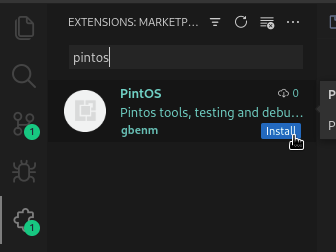

# PintOS vscode

## Prerrequisitos para usuarios Windows
 - Sistema operativo Windows 10 64-bit Home o Pro o superiores.
 - Instalar [Docker Desktop](https://docs.docker.com/desktop/install/windows-install/).
 - Instalar [WSL versión 2](https://learn-microsoft-com.translate.goog/en-us/windows/wsl/install?_x_tr_sl=en&_x_tr_tl=es&_x_tr_hl=es-419&_x_tr_pto=sc).

## Instalación
Ve a la pestaña de extensiones dentro de visual studio code y busca "pintos"

## Características Principales

- Instalación del proyecto PintOS
- Puede configurar un dev container usando [gbenm/pintos](https://hub.docker.com/r/gbenm/pintos)
- Ejecutar los tests
- Depuración de los tests

