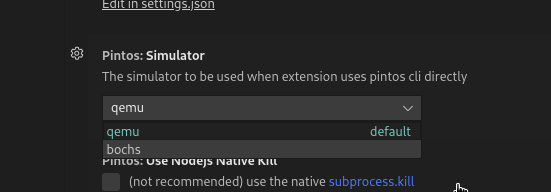
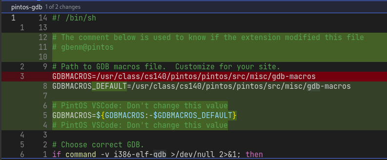
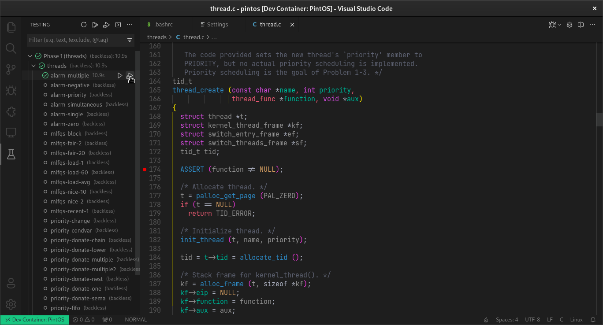
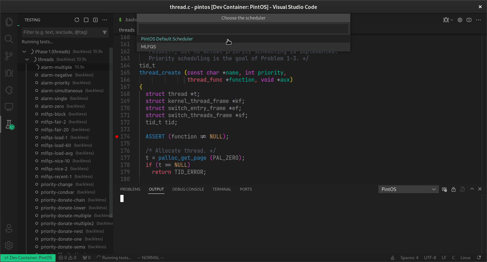
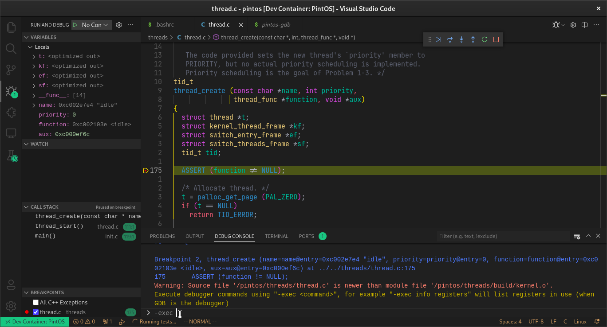
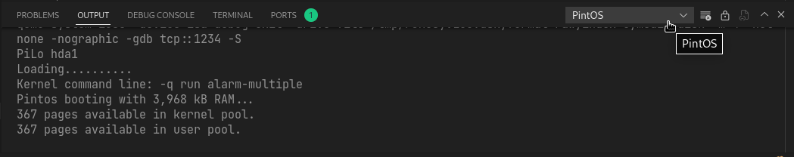

# Debug tests

## Cómo funciona

> Lo siguiente se resume en un click, pero la explicación tiene
> motivo de mejorar la experiencia de debugging

Para debuggear en Pintos se necesitan 2 cosas, una es levantar un gdb server
seleccionando un test mediante `pintos ... --gdb -- ... -q run TEST`,
este proceso juega el papel de mostrar el output del test conforme se avanza
en el debugger y la segunda es ejecutar `pintos-gdb` que es un script que
ejecuta `gdb` y configura las macros personalizadas de Pintos, aquí es dónde
se puede hacer el típico de "colocar un breakpoint", "ir a la siguiente línea",
y demás

## Configuración

> Si utiliza el dev container o sigue las indicaciones de la guía del
> frijol no debe cambiar esto

Cómo se mencionó anteriormente la extensión tiene que hacer uso directo de
la CLI de pintos para levantar el **gdb server** por lo que debe seleccionar
sobre que simulador va correr, por defecto está configurado para correr
`qemu` si se necesita cambiar esto, es necesario ir a la configuración de la
extensión y cambiar el simulador

:::info
No se necesita modificar `utils/pintos-gdb` para configurar `gdb-macros`
la extensión automáticamente agrega un parche al código de `pintos-gdb`
(mantiene el valor por defecto) para que pueda ser cambiado externamente

El contenido rojo es lo eliminado y el verde las nuevas líneas. El objetivo
de este parche es que la extensión pueda seleccionar las gdb-macros locales
del proyecto actual
:::

## Debuggear

### Iniciar la sesión de debugging

Prepare lo que necesite para la sesión de depuración (por ejemplo colocar
los breakpoints) luego presione en el icono de debugging del tests que
quiere debuggear

### Seleccionar scheduler

Conforme avance en el curso (y el proyecto) entenderá la diferencia
entre los schedulers, por ejemplo los tests que tienen un nombre que
inicia con **mlfqs** están destinados a ser ejecutados con este scheduler,
por lo que para buscar errores en estos debería seleccionar dicho scheduler,
como en este ejemplo se está usando `alarm-multiple` el scheduler a usar
es el por defecto (cuándo se hace `make grade` se puede ver en los logs
con que simulador se usa, si lleva `-mlfqs` como flag es porque selecciona
dicho calendarizador y si no lo tiene, usa el por defecto)

### "Debug Console" y la sección "Run and Debug"

Después de seleccionar el scheduler, se inicia el modo debugging y por defecto
en la izquierda se tiene la sección **"Run and Debug"** con una interfaz con los
comandos más utilizandos al debuggear y abajo la **"Debug Console"** que es la interfaz
directa con la sesión de gdb, desde ahí puede utilizar `-exec GDB_COMMAND` para utilizar
los que no aparezcan en la interfaz.

:::note
Como resumen esta sección adapta el segundo paso para debuggear de la sección
[cómo funciona](#cómo-funciona)
:::

### Sección Output

Al lado de **"Debug Console"** se encuentra **"Output"**, dentro de las opciones
del dropdown se encuentra **PintOS**, esta sección adapta el paso 1 de
[cómo funciona](#cómo-funciona), con esto puede observar la evolución del output
del test desde vscode

