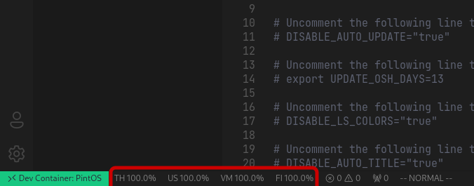
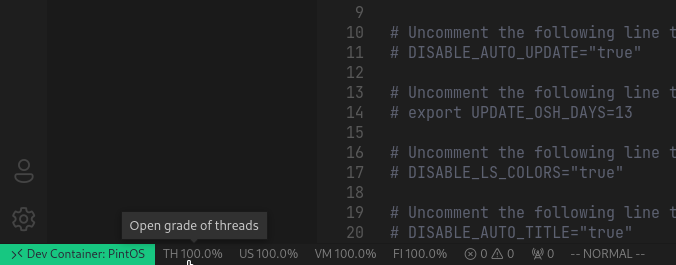
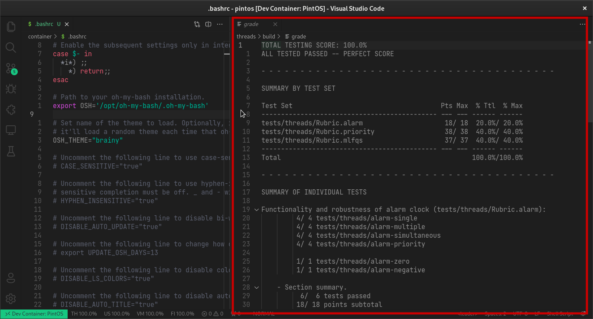

# Los archivos Grade

Estos archivos contienen toda la información sobre las pruebas en cada
fase, se generan después de ejecutar `make grade` y terminar

:::note
Si `make grade` se interrumpe no generará este archivo
:::

## Ver calificación actual
PintOS vscode permite visualizar la nota actual de cada fase que contenga
un archivo `grade` y está disponible en la sección de "status bar" de
visual studio code

:::info
Cada item en el status bar contiene las 2 primeras letras de cada fase:
**TH**reads, **US**erprog, **VM**, **FI**lesys
:::

## Abrir los archivos grade

Cada item en el status bar que contiene el porcentaje actual sobre cada
fase del proyecto, permite abrir el archivo grade correspondiente

