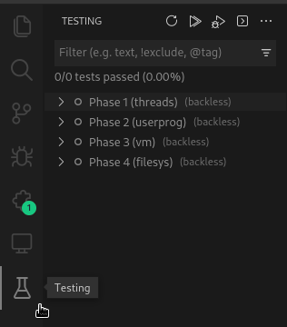
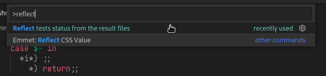
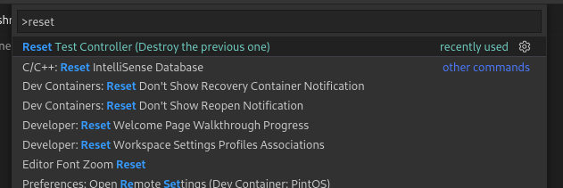

# Introducción y conceptos base

:::caution Advertencia inicial
La extensión funciona bajo el concepto de que no haz modificado los
archivos `utils/pintos` y `utils/Pintos.pm`, mueve el proceso
para que se encuentre en el directorio adecuado y que la CLI busque
el `kernel.bin` y `loader.bin` que corresponden. Si decides por alguna
razón modificarlo, ten en cuenta que es tu responsabilidad cambiar
a la respectiva fase que vayas a testear (recomendación no te compliques
la vida xD).
:::

## Sección de testing

Visual studio code tiene una sección llamada testing que es la que será
el tema de conversación en esta sección de la documentación. Lo primero
que debes hacer es dirigirte al sidebar y presionar el icono con forma
de matraz

Al estar en esta sección encontrarás los tests principales de PintOS,
los que corresponden a cada fase del proyecto, puedes expandirlos para
ver cuáles son los tests que están incluídos en cada fase, algo que
te puede llamar la atención es la palabra **"backless"** que verás
a la para de todos los tests.

### Qué significa backless en los tests?

Los tests de Pintos originalmente se corren con `make grade` o
`make build/tests/.../test.result`, como resultado imprime
a consola si ha pasado o no y genera unos archivos `.result` y
si se corrió `make grade` y ha terminado te vas a encontrar
con un archivo `grade` en directorio `build/` **backless** se
refiere a que el resultado actual no está respaldado por los
archivos `result` por lo que no es seguro de que el estado
del test siga siendo el mismo.

:::tip
considera correr nuevamente los tests que tengan esta etiqueta al
tener oportunidad
:::

## Reflejar el estado actual de los tests
Los tests están respaldados por los archivo `.result` y puede darse
el caso de que la vista no esté actualizada, si existe la sospecha
de que el estado visual puede estar desactualizado, puede correr
el comando para reflejar el estado actual de los tests, este se
basa en los archivos dentro de la carpeta buid/tests de cada
fase.

Abra la paleta de comandos y busque por "reflect tests status"

## Test Controller

La sección de testing mencionada anteriormente es realmente
la capa de presentación que puede ver el usuario, detrás
de esto se encuentra un componente denominado **test controller**,
es necesario mencionarlo para tener un seguro de que hacer
si se encuentra un problema visual con la parte de testing y
así evitar reiniciar el editor de código, sino que solamente
el componente.

### De qué se encarga?

> Realmente hay varios componentes que se van a resumir en este

- Traslada las acciones del usuario a la ejecución de los comandos
  necesarios para llevar acabo la acción, por ejemplo responde a las peticiones
  de ejecución de los tests dependiendo de que parte se esté utilizando para
  esto (los tests principales, las agrupaciones o los individuales)
- Mostrar los resultados por el **output channel** del editor
- Actualizar los resultados de los tests en la vista de testing
- Detener la ejecución si es necesario
- Compilar las fases
- **Vigilar el file system** en busca de actualizaciones externas
  - Puede actualizar los resultados (un caso de uso para esto sería
    si el usuario decide correr `make grade` desde afuera del editor)
  - Colocar **"backless"** si se han eliminado los archivos **result**
- Controlar el ciclo de vida del debugger para el tests seleccionado

### Reinicio en caso de problemas

Como se puede ver hay mucho sobre los hombros de este componente
y por ende es bueno tener a la mano una forma de reiniciarlo en
caso de ver un problema.

:::info
No todo es sobre problemas, también puede darse en caso que quieras
refrescar el controlador porque cambiaste una configuración o
bien tener la compilación inicial que tiene la extensión.
:::

Para realizar esto sólo debes abrir la paleta de comandos y buscar
por "reset test controller"

:::note
Este es el siguiente paso a tomar en cuenta si [reflejar el estado
actual de los tests](#reflejar-el-estado-actual-de-los-tests) no parece solucionar el fallo visual
:::
