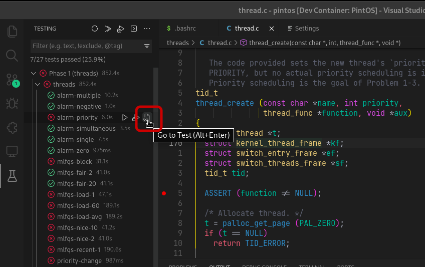
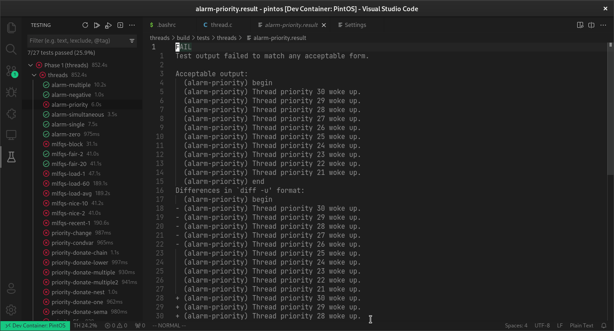
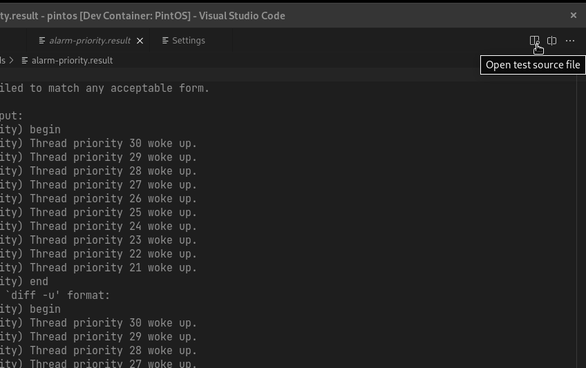
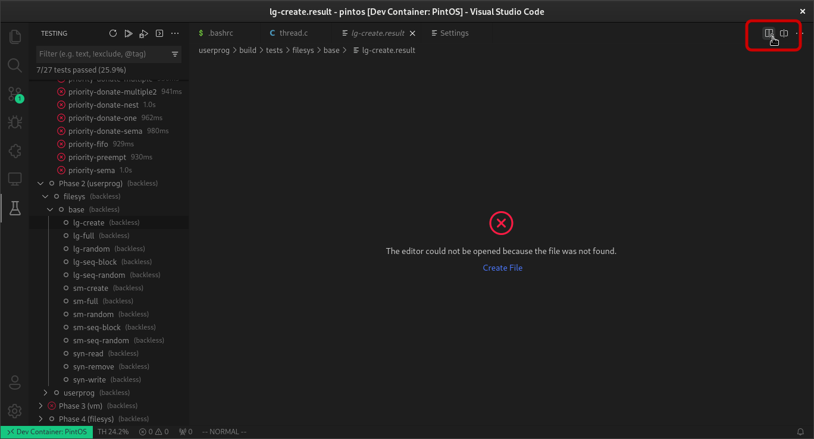
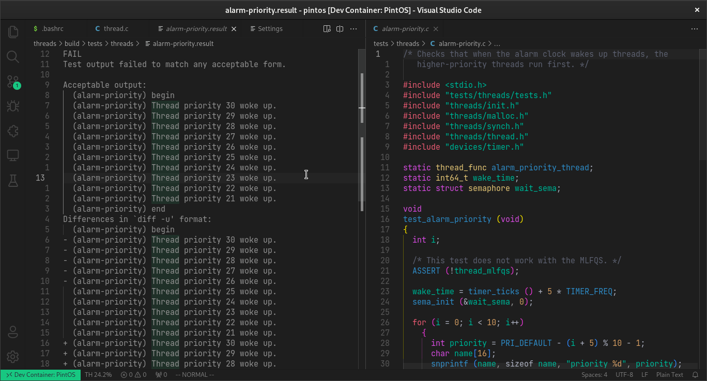

# Abrir los resultados del test

Los archivos de resultados contienen la información sobre los fallos
de los tests, aunque hay ocasiones dónde no están presentes, por ejemplo
si se eliminan externamente o si el `make` obtuvo un error y no
pudo terminar su tarea.

## Abrir los resultados desde la sección de testing

En la sección de testing, cada test individual tiene un icono de archivo,
presione sobre él para abrir el archivo de resultados para un test en
específico.

Después de esto, el editor abrirá el archivo de resultados automáticamente

## Abrir el código de la prueba

Para ver el código fuente del test sin tener que buscar en los folders
dentro del directorio `tests/` sólo debe estar posicionado en el
archivo de resultados (recuerde que puede
[abrir los resultados del test desde la sección de testing](#abrir-los-resultados-desde-la-sección-de-testing))
y presionar en "open test source file"

:::info
El botón aparece aunque el archivo de resultados no exista y puede usarse sin
problemas

:::

Después se abre una pestaña en la segunda columna del editor con el archivo
que contiene el código de la prueba

:::note
Las pruebas están hechas en "C" y "Perl"
:::
