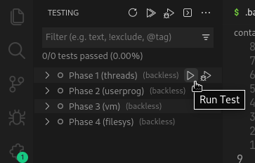
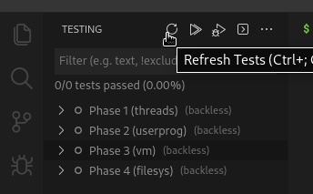
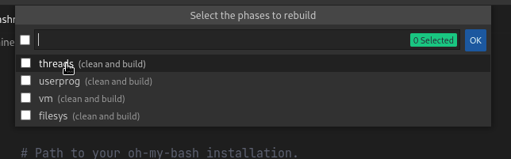
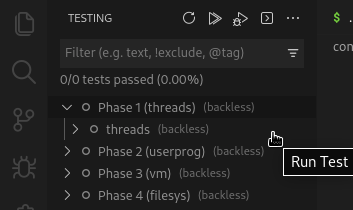
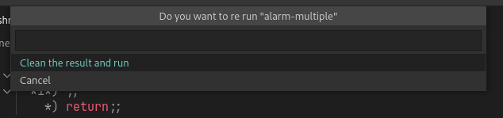

# Correr los tests

## Tests Principales

Los tests principales son los primeros que se pueden ver
al abrir la sección de testing, además que tienen un
nombre como **"Phase # (NOMBRE)"**, cuándo corres estos tests
se traduce a un `make grade` por lo que además de obtener los
resultados también se generará el archivo `grade` que se mencionó
en la sección introductoria, que contiene la información y
nota sobre esta fase.

:::tip
Es recomendable utilizar este si se van a correr varios tests o
al menos volverlo a ejecutar si se han corrido tests individuales,
esto con el propósito de actualizar el archivo de calificación en
caso de tener cambios en el estado del tests.
:::

### Refresh de los tests

Si todos los archivos ya están actualizados **no se volveran a correr**,
si se necesita volver a correr el test principal, es necesario ir a la parte
de **refresh** para limpiar y volver a compilar:

Seleccione las fases que necesita limpiar y volver a compilar

Esto **no ejecuta** los tests automáticamente, sólo sirve para limpiar y compilar

## Agrupaciones de tests

Dentro de los tests principales se encuentra subdirectorios que prueban
funcionalidades en específico, al dar **"run"** a estos se ejecutará un
`make build/tests/.../TEST.result` por cada [test individual](#tests-individuales) que contenga,
incluyendo otras agrupacaciones.

:::caution
Las agrupaciones de tests no refrescan el archivo `grade` (mismo comportamiento que los
individuales)
:::

La fase de Threads en la versión conocidad hasta ahora sólo contiene una agrupación
sin embargo ejecutar la agrupación difiere en la forma en que se ejecutan los tests
además que no se obtendrá el archivo `grade` si en dado caso por error lo ha ejecutado
y a terminado su ejecución ejecutar el **test principal** sólo actualizará el archivo
grade.

## Tests individuales

Son ideales para concentrarse en una sólo cosa a la vez, además que existen tests
que se tardan una buena cantidad de tiempo y pueden no ser el foco del código hecho
en un determinando momento.

:::caution
Los tests individuales no actualizan el archivo `grade`
:::

:::info
Los tests individuales se ejecutan usando `make build/tests/.../TEST.result`
:::

### Confirmación

Cómo medida de seguridad si el tests ya tiene un archivo result, estos no
se ejecutan inmediatamente sino que se require confirmación

