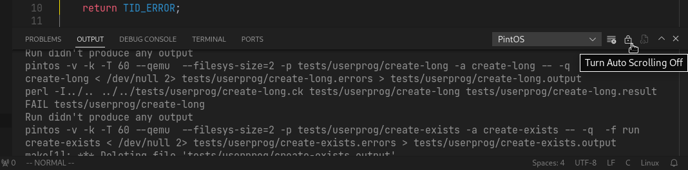
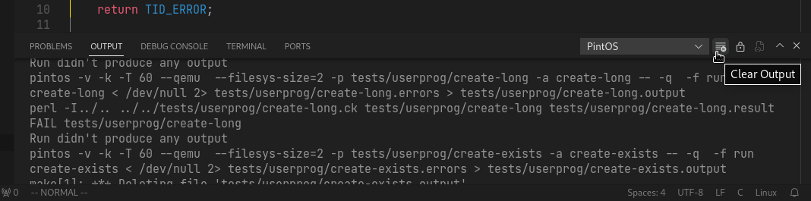

# Recomendaciones generales

## El output de la extensión

Por el momento todo el output de compilación y ejecución se escriben
en el output (ver la pestaña output del editor) **PintOS** y por la velocidad
de escritura es fácil perder la posición actual y mantener limpio el output

### Alternar propiedad Auto scroll en el output



Alternando entre off/on se puede decidir si permanecer en la posición actual
o seguir el final de output automáticamente

### Limpiar el output



Cada vez que se inicie una operación dónde es importante ver el output, lo mejor
es limpiarlo para que no se mezcle con operaciones anteriores

## Clonar repositorios propios

:::info
Esta sección se refiere a que ya se ha instalado previamente el proyecto
y esta vez se require clonar el proyecto dónde se va a trabajar
:::

Cómo se comentaba en la sección de "crear un nuevo proyecto" dependiendo
del sistema operativo se pueden tener problemas con los saltos de línea,
para evitar esto puedo utilizar

```bash
git -c core.autocrlf=false clone REPO_URL
```

Reemplace **REPO_URL** con el url del repositorio del código.

:::info
`core.autocrlf=false` le dice a git que no debe cambiar los saltos
de línea de los archivos independiente del sistema dónde se encuentre,
este es el problema con Windows para este proyecto. Se asume que el
repositorio tiene `LF` para terminaciones de línea
:::

